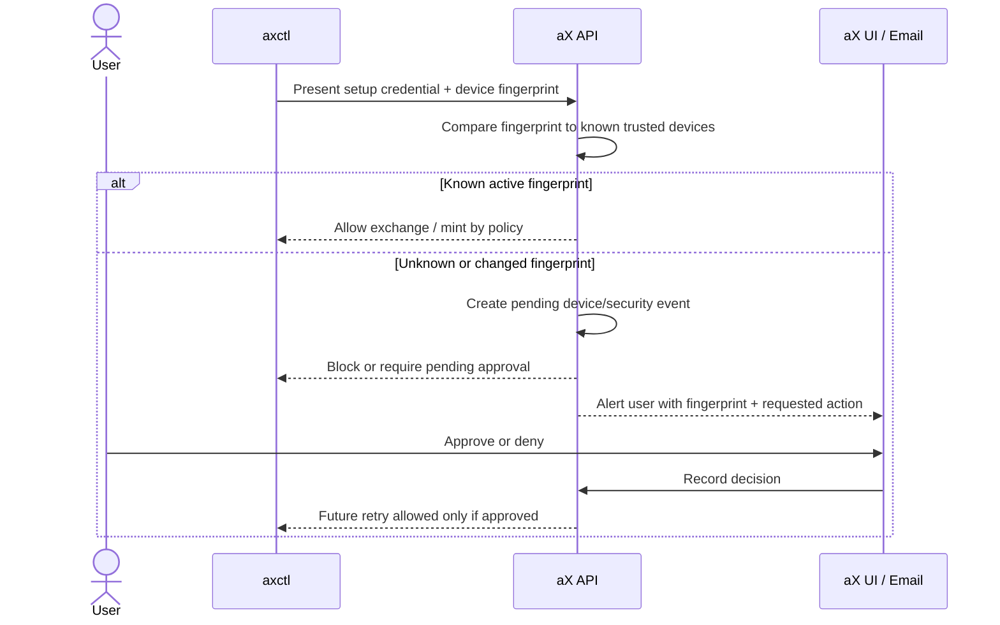

# DEVICE-TRUST-001: Device Trust and Approval

**Status:** Draft  
**Owner:** @alex / @ChatGPT  
**Date:** 2026-04-13  
**Related:** AXCTL-BOOTSTRAP-001, AGENT-PAT-001, docs/credential-security.md

## Summary

Define the trust model for devices that run `axctl`.

The device is the trust anchor for local CLI operation. The user bootstrap token
establishes the device once; after that, authorization decisions should be based
on a registered device public key, device credential, user policy, and audit
history.

This replaces the weaker idea of letting a trusted agent read or reuse a user
token. Agents receive agent-scoped credentials. Devices request them.

## Core Principle

```text
User bootstrap token -> device trust
Device trust -> agent PAT minting policy
Agent PAT -> short-lived access JWT
```

No arrow points from agent back to raw user token material.

## Device Record

Each enrolled device should have:

- `device_id`
- `user_id`
- `public_key`
- `public_key_fingerprint`
- `display_name`
- `platform`
- `first_seen_at`
- `last_seen_at`
- `last_ip_hash` or coarse network metadata, if retained
- `status`: `pending | active | suspended | revoked`
- `capabilities`: policy grants such as `mint_agent_pat`
- `revocation_version`

## Device Fingerprint

The UI should show a stable fingerprint derived from the public key, not from a
raw token hash.

Recommended display:

```text
SHA256: 4F2A 91C7 9B10 55E0
```

Why public-key fingerprint:

- It identifies the device keypair.
- It does not expose token material.
- It can be shown safely in terminal and UI.
- It proves continuity across future requests.

Why not raw token hash as the primary trust anchor:

- A token hash does not prove where the token is used.
- Copied token material has the same hash from every machine.
- Public-key signatures prove possession of the device private key.

## Approval Model

### v1 Default

- `axctl init` enrolls a device from a valid bootstrap token.
- First-time agent creation or first-time agent PAT minting may require explicit
  user approval depending on policy.
- Silent renewal is allowed only for already-approved agent identities and
  still emits audit events.
- If a credential is presented from an unknown device fingerprint, the backend
  should fail closed into a pending approval state rather than silently allowing
  the request.

### Policy Variants

| Policy | Behavior |
|--------|----------|
| Personal permissive | Trusted device can mint PATs for the user's own agents. |
| Team explicit | Trusted device can request PATs, but first-time agent identity requires user/admin approval. |
| Enterprise locked | Device enrollment and PAT minting require admin approval. |

## Device Approval UI

The UI should support:

- List devices.
- Show device name, platform, created time, last used time, and fingerprint.
- Revoke device.
- Suspend device.
- Approve or deny pending device.
- Toggle whether a device may mint agent credentials.
- Show recent audit events for that device.
- Surface pending or suspicious device-use events as account alerts.
- Optionally send an email verification or security notification for first-time
  device use, changed fingerprint, or blocked mint attempts.

Example copy:

```text
Authorize new device

Device: Alex's Laptop
CLI: axctl 0.4.0
Fingerprint: SHA256 4F2A 91C7 9B10 55E0
Requested access: Mint agent credentials for this workspace

[Approve] [Deny]
```

## New Device / Changed Fingerprint Flow

The intended product behavior for reused or copied bootstrap material is:



Product notes:

- The alert should identify the account, device display name, fingerprint,
  requested action, created time, and coarse origin metadata if available.
- Approval should be visible from Settings > Credentials or a future Security
  / Devices tab.
- Email can be a secondary notification channel, but the durable decision should
  live in the platform UI and audit log.
- If the user denies or ignores the request, the token/device attempt remains
  blocked.

## Request Signing

Device-authenticated requests should prove possession of the private key.

Draft header model:

| Header | Purpose |
|--------|---------|
| `X-AX-Device-ID` | Registered device id. |
| `X-AX-Device-Fingerprint` | Public key fingerprint for logging/debugging. |
| `X-AX-Device-Timestamp` | Replay window. |
| `X-AX-Device-Nonce` | Replay prevention. |
| `X-AX-Device-Signature` | Signature over method, path, body hash, timestamp, nonce. |

This can be phased in. v1 may use a device credential plus existing JWT
exchange while preserving the same device record and audit model.

## Audit Events

Minimum audit events:

- `device.enrollment_requested`
- `device.enrolled`
- `device.approved`
- `device.suspended`
- `device.revoked`
- `device.credential_used`
- `device.agent_pat_requested`
- `device.agent_pat_issued`
- `device.agent_pat_denied`

Audit record fields:

- event type
- actor user id
- device id
- space/workspace id
- target agent id, if applicable
- credential id, if applicable
- timestamp
- request fingerprint
- decision and reason

## Revocation

Revocation must be independent:

- Revoke a device without deleting agents.
- Revoke one agent PAT without revoking the whole device.
- Revoke all credentials issued by one device if it is compromised.

Recommended backend behavior:

- Device revocation increments `device.revocation_version`.
- Access JWT exchange checks device status and revocation version.
- Agent PATs include issuer device id and issuer revocation version.
- Optionally invalidate downstream agent PATs when the issuer device is revoked.

## Threats and Mitigations

| Threat | Mitigation |
|--------|------------|
| Bootstrap token copied before init | Short TTL, one-time use, audit, device approval. |
| Device credential copied from disk | OS keychain, future hardware keys, fingerprint anomaly detection. |
| Agent tries to mint more credentials | Agents do not receive user/device credential material; backend enforces issuer class. |
| Rogue device mints agent PATs | Device capability policy, audit, revocation, optional approval. |
| Replay of device request | Timestamp, nonce, request signing. |

## Acceptance Criteria

- Device records are visible and revocable in UI.
- Device fingerprint is based on public key material.
- Device credential cannot be retrieved from the backend.
- Agent PAT mint requests include issuer device id.
- Device revocation blocks future device-authenticated exchanges.
- Agents cannot request user bootstrap token material through CLI, MCP, or API.

## Open Questions

The following questions an implementer would need answered to move this spec
from **Draft** to **Accepted**. Each is a place to land a decision (or surface
a counter-question) inline; reviewers should feel free to answer in-thread on
the corresponding line.

Surfaced during a review on 2026-05-24, prompted by the containerized-agent
trust work in #87 / #89 / #90 / #91 where this spec was identified as the
strategic destination.

### 1. Device enrollment mechanism

**Question:** How does a fresh device obtain its public-key registration with
the backend?

**Why it matters:** The spec says *"`axctl init` enrolls a device from a valid
bootstrap token"* and then assumes the device is enrolled for the rest. The
entire trust model rests on this step. Without a defined flow there is no v1.

**Sub-questions:**
- Where is the keypair generated? (Locally in axctl? Hardware-backed where
  available?)
- What does the enrollment HTTP request look like? (`POST /api/v1/devices` with
  a CSR-like payload?)
- Does the bootstrap token get *exchanged for* a device credential, or do they
  coexist for a period?
- Is enrollment interactive (waits for UI approval) or asynchronous (returns
  pending, CLI polls)?

### 2. "Device credential" needs a single definition

**Question:** What is a "device credential," concretely?

**Why it matters:** The term appears in multiple places with seemingly
different meanings:

- Line 170: v1 may use *"a device credential plus existing JWT exchange"* — sounds like a static credential.
- Line 219 (threats table): *"Device credential copied from disk"* — confirms it lives on disk.
- The Request Signing section (line 156): all device-authenticated requests are signed with the private key — sounds like the *key itself* is the credential.

Is the device credential:

- (a) A static API token bound to a device id?
- (b) A JWT minted from a signed challenge at session start?
- (c) The private key itself, used to sign each request directly?
- (d) Some combination phased over v1 → v2?

These have very different storage, replay, and rotation implications.

### 3. Private-key storage on headless Linux

**Question:** What is the v1 answer for private-key storage on platforms
without an OS keychain — headless Linux servers, CI runners, containers
without a session D-Bus?

**Why it matters:** Line 219 mentions *"OS keychain, future hardware keys"*
as the mitigation against on-disk credential copying. Mac Keychain, Windows
Credential Manager, and `libsecret` cover desktop cases. Headless Linux
(the most common ax-gateway server deployment, and exactly the
containerized-agent case in #87) has none of these by default.

Options:
- (a) Plain on-disk file with mode 0600 in `~/.ax/device/` — pragmatic, but
  exactly the threat row #2 of the threats table flags.
- (b) Require a user-supplied passphrase to unlock the key on each axctl
  invocation — security win, UX loss.
- (c) Defer the headless case; only ship v1 to platforms with a keychain.
  Leaves the most common deployment shape unaddressed.
- (d) Allow a pluggable backend (env-driven: `AX_DEVICE_KEY_PROVIDER=file|libsecret|...`)
  and ship a sensible default per platform.

This question directly determines whether DEVICE-TRUST-001 helps the
containerized-agent setup that prompted this review (#87), or whether
that case needs an orthogonal solution.

### 4. Backwards compatibility and migration

**Question:** How do existing `axp_u_*` user PATs and existing axctl installs
continue to work as DEVICE-TRUST-001 rolls out?

**Why it matters:** There is an installed base of `axctl` users. A flag-day
cutover is hostile; a coexistence window needs explicit rules.

Sub-questions:
- Do existing user PATs continue to authenticate indefinitely, or get
  end-of-lifed on a date?
- During coexistence, are device-authenticated requests *preferred* over
  PAT-authenticated requests for the same operation?
- Is there a migration command (`axctl device enroll --from-pat`)?
- What's the operator-visible signal that they should migrate?

### 5. Header naming conflict with existing fingerprinting

**Question:** How do the proposed `X-AX-Device-*` headers relate to the
existing `X-AX-FP-*` fingerprint headers in `docs/credential-security.md`?

**Why it matters:** The codebase already uses `X-AX-FP-*` for the
workdir+hostname+OS-user fingerprint sent on every request. If
`X-AX-Device-*` is purely additive, we have two parallel systems. If it
replaces `X-AX-FP-*`, that's a wire-compat change worth calling out.

Options:
- (a) Coexist: device headers prove possession; fingerprint headers stay for
  anomaly detection.
- (b) Subsume: device fingerprint replaces the workdir-derived fingerprint;
  delete `X-AX-FP-*` over a deprecation window.
- (c) Rename `X-AX-FP-*` to `X-AX-Workdir-*` to disambiguate, keep both.

### 6. `mint_agent_pat` capability mechanism

**Question:** Where is the `mint_agent_pat` capability set, and what is its
default state?

**Why it matters:** Line 44 lists `capabilities` as a device-record field with
`mint_agent_pat` as an example. The Approval UI section (line 101) shows a
toggle. The backend semantics aren't spelled out.

Sub-questions:
- Is the capability granted per-device, or inherited from the user's policy?
- Default state for a freshly-enrolled device: granted or pending?
- Can a non-admin user toggle it on their own devices, or is it admin-only?
- Does revoking the capability affect already-issued agent PATs, or only
  future mints?

### 7. CLI UX flow

**Question:** What does the operator see and type during enrollment, the
pending-approval window, and a fingerprint change?

**Why it matters:** The spec shows UI mockups for paxai.app but no axctl CLI
sequences. axctl is the primary surface for the operators implementing this.

Concrete sequences worth specifying:
- First-time enrollment from a clean machine
- Enrollment while approval is pending (block? print URL? poll?)
- Re-keying after a private-key compromise
- Operator-initiated revocation of their own device
- Fingerprint change after a workstation reinstall

### 8. Implementation ownership and phasing

**Question:** Who implements this, and in what order?

**Why it matters:** The spec is backend-heavy. Without a paxai.app team commit
the CLI work can't land in a useful way. Without a phasing plan, reviewers
can't tell what lands first and what depends on what.

Suggested phasing:
- Phase 1: device record schema + enrollment endpoint + on-disk credential
  storage (pragmatic v1, accepts on-disk threat).
- Phase 2: approval UI, audit events, capability policy.
- Phase 3: request signing, replay prevention, anomaly detection on
  fingerprint mismatch.
- Phase 4: hardware-key / OS-keychain integration where available.

This is one possible phasing — it would be useful to converge on *a* plan,
not necessarily this one.

---

### Stepping-stone considered, rejected

A narrowly-scoped one-time `axp_boot_*` "mint-only" token (single-use, ~10min
TTL, scoped to one agent name in one space) was considered as an interim
mitigation for the containerized-agent trust gap in #87. Decision: **do not
ship it as a separate feature.**

Reasoning: it would be a fourth credential type alongside user PATs, agent
PATs, and (incoming) device credentials. It would get strictly subsumed once
DEVICE-TRUST-001 lands — device-signed scoped tokens are better than static
scoped tokens. And shipping it risks reducing urgency on the real fix.

What got shipped instead as the lowest-effort partial mitigation: #87 (the
`--no-persist` flag on `ax gateway login`), which shrinks the user-PAT-on-disk
window from 24h to "the few seconds between login and the next mint" without
introducing a new credential class.
